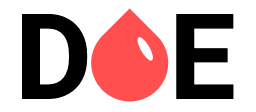

<h1 align="center">
    
</h1>

<h4 align="center">
  ⌨ Semana da MaratonaDev 3.0 💻
</h4>

        
        

## Projeto
É um projeto que visa buscar doadores de sangue que querem salvar a vida de milhares de pessoas!

### Projeto: Na visão de desenvolvimento
O projeto é desenvolvido com o intuito de iniciar um contato mais direto com as tecnologias web, desenvolvendo desde o front-end até o back-end utilizando apenas HTML, Css e Js(node). 

### Tecnologias Utilizadas
- [Node.js](https://nodejs.org/en/)
- [Nunjucks](https://mozilla.github.io/nunjucks/)
- [PostgresSQL](https://www.postgresql.org/)

### Ferramenta Nunjucks
- npm install nunjucks;
- Template engine;

### PostgresSQL
- npm install pg;
- Banco de dados

### :memo: Licença

This project is under the MIT license. See the archive [LICENSE](LICENSE) for more details.

Feito com a comunidade da RocketSeat e